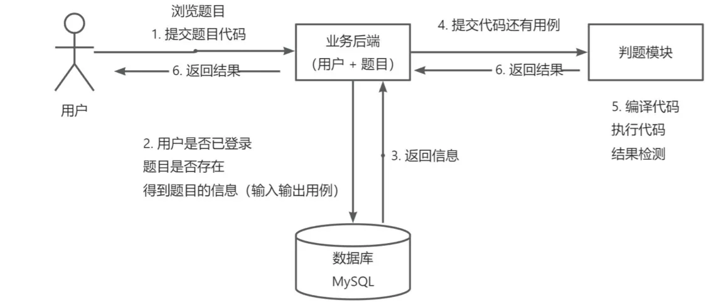
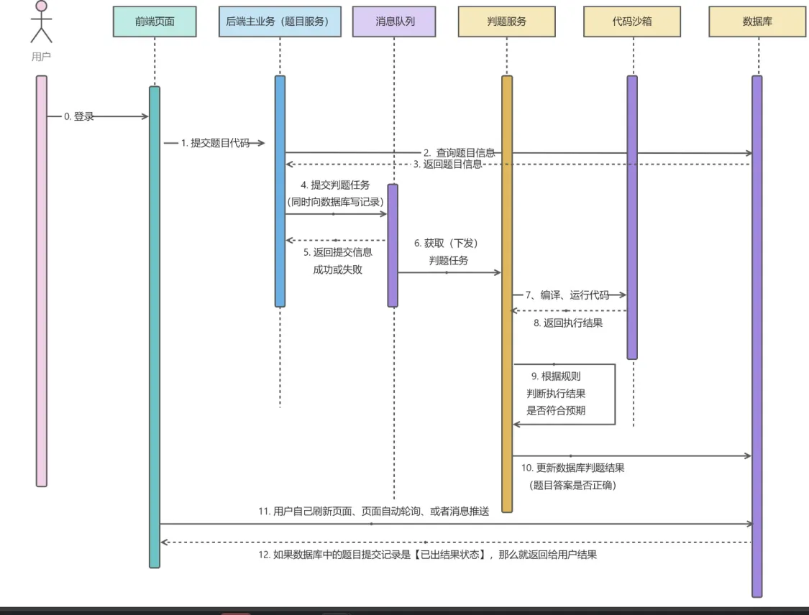
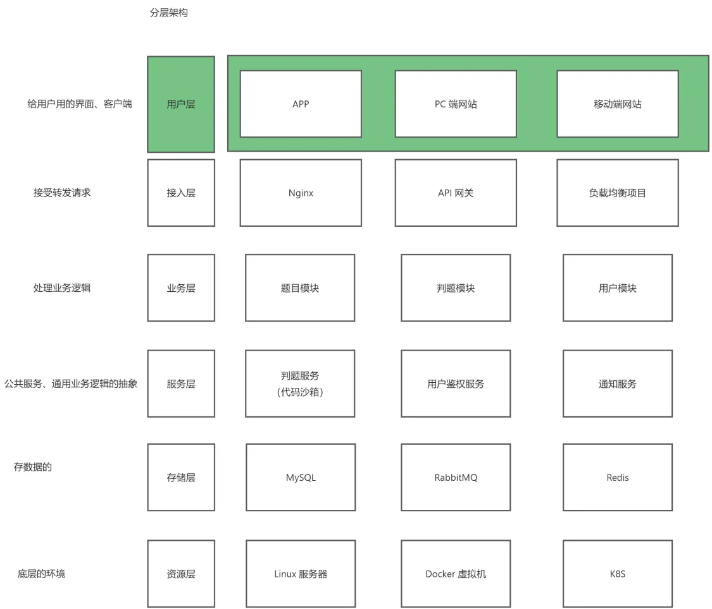

# 大二暑假开发的oj系统
jlnuOj-mojbr>
mar1 
# 2024-07-1 开始
# moj

## 项目介绍

基于 vue + Spring Boot。

### 实现的核心思路
1）权限校验

谁能提代码，谁不能提代码

2）代码沙箱（安全沙箱）

用户代码藏毒：写个木马文件、修改系统权限

沙箱：隔离的、安全的环境，用户的代码不会影响到沙箱之外的系统的运行资源分配

3）判题规则

题目用例的比对，结果的验证

4）任务调度

服务器资源有限，用户要排队，按照顺序去依次执行判题，而不是直接拒绝

###流程图

暂定的核心技术如下，可能会引入新技术

### 前端

- vue + 组件库:arco-design + 代码编辑器
- 前端工程化：ESLint + Prettier + TypeScript

### 后端

- Java Spring Boot + MySQL + MyBatis Plus
- Java进程控制器
- Spring Cloud 微服务 :nacos 消息队列
- Redis
- 对象存储
- ## 架构设计

